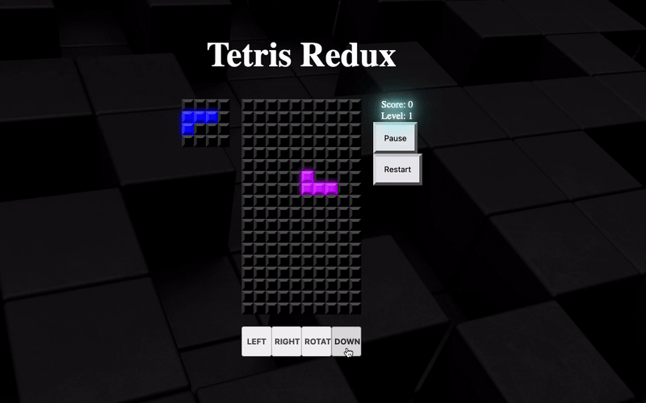

# Tetris

This is a Tetris game implemented using React and Redux.



## Installation

To run this project locally, follow these steps:

1. Clone the repository:

```
 git clone https://github.com/this-is-emma/assignment4.git
```


2. Navigate to the project directory:

```
  cd assignment4
```


3. Install dependencies:

```
 npm install
```

4. Start the development server:

```
  npm start
```

5. Enjoy !
